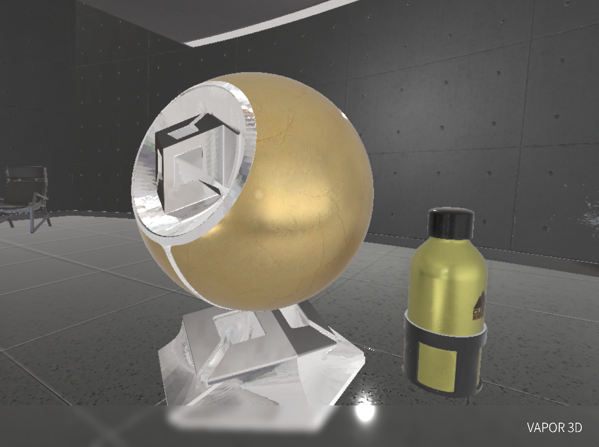
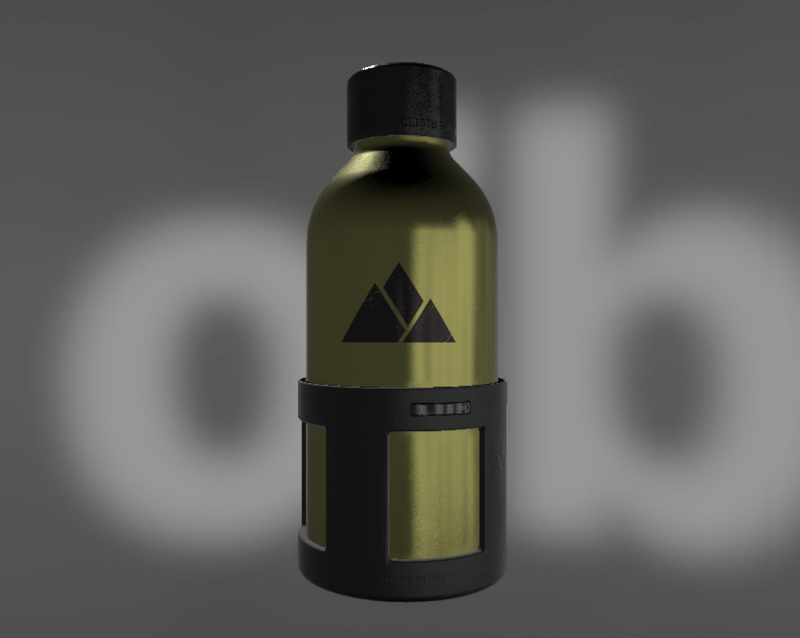
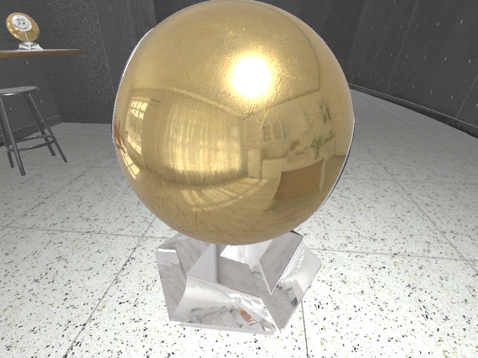
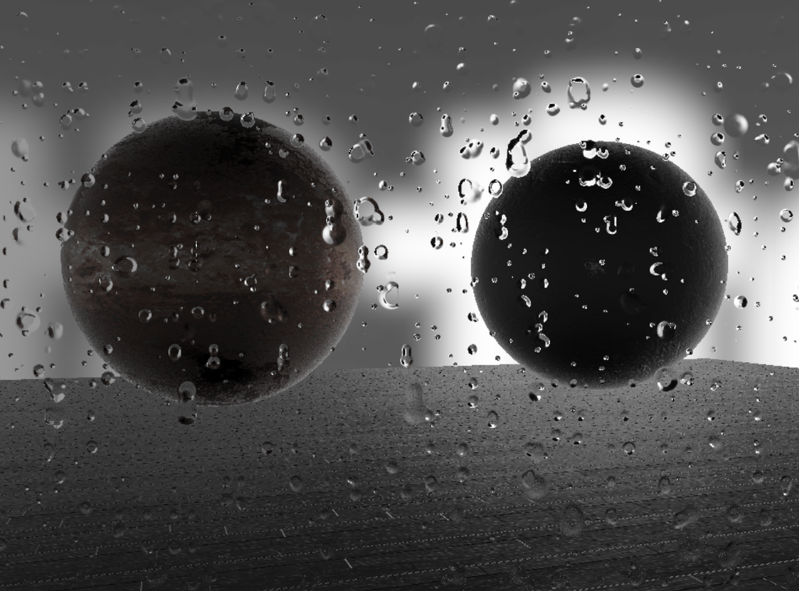
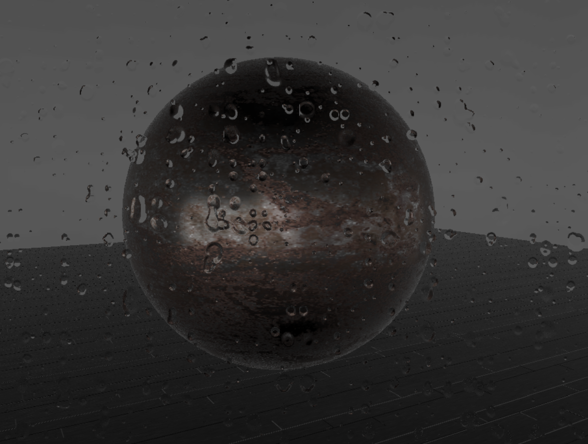

# Vapor 3D Engine

高性能、可编程的 **多阶段渲染管线 (Multi-Stage Pipeline)** 框架。

---

> **TODO**: 扩展处于测试阶段，遇到问题欢迎向我反馈。文档目前仅为大纲，将来有时间会来完善。

---

## 核心特性

* **完全可编程管线**：引擎不内置任何渲染算法。开发者可完全接管并自定义 Shader 逻辑。
* **自定义渲染阶段**：引擎框架设计支持高效的中间数据交换，支持延迟渲染、G-Buffer 架构及代理几何体等高级技术的二次开发。

## 渲染效果

* 可前往 example/ 查看我最近在写的一些二次开发作品，均采用MIT开源

---
> <small>本文档及 `example/pbr.sb3` 中使用的资源致谢：PBR 贴图 (FreePBR.com)、IBL 预卷积贴图 (cmftStudio)、Water Bottle 模型 (Khronos Group, CC-BY 4.0)、UV Grid 贴图 (Three.js, MIT)、 BRDF 查找表 (LearnOpenGL, CC BY-NC 4.0)、示例场景模型（Unity）。所有资源仅供学习与非商业演示使用，版权归原作者所有。该扩展引用了第三方库gltf-loader-ts，在此鸣谢</small>

**By: Joy_Ful** | License: MPL-2.0
